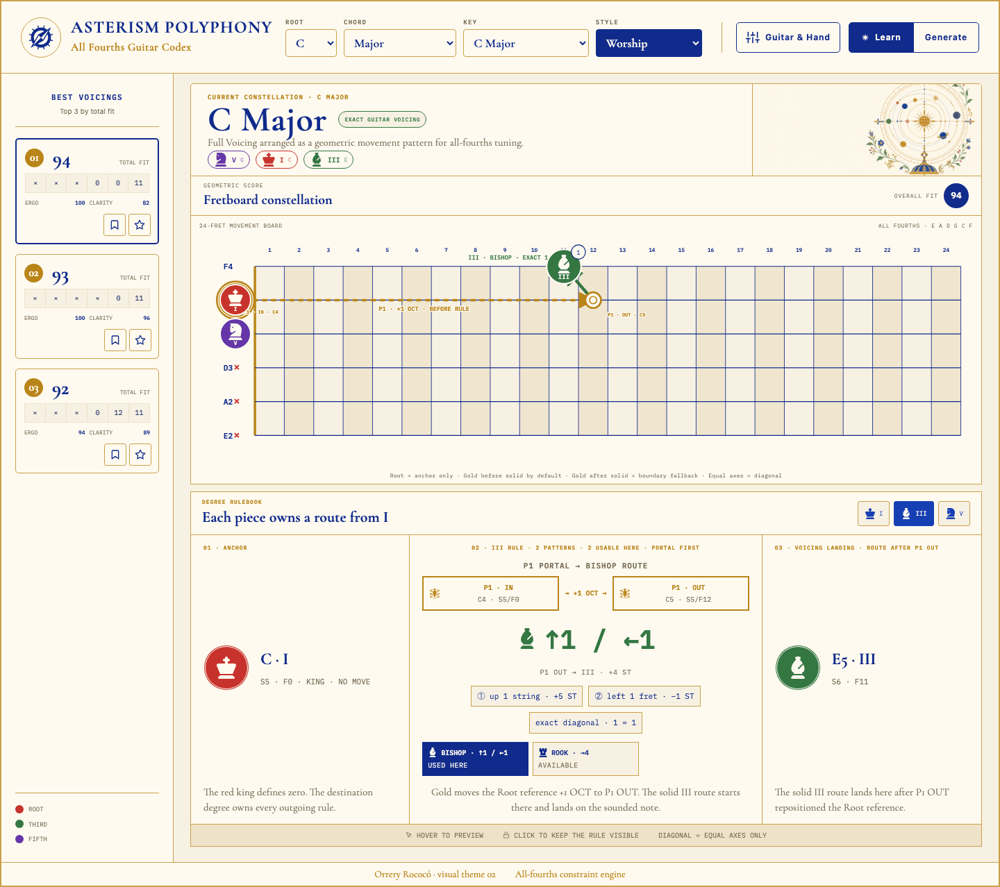
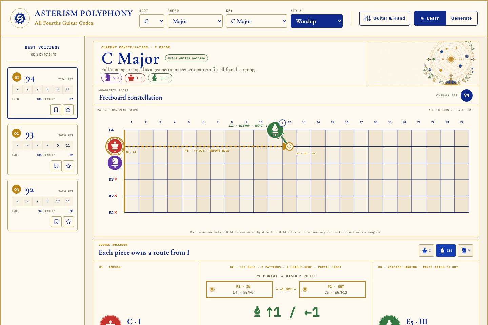
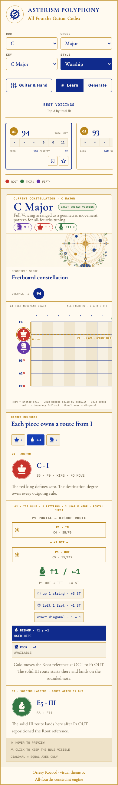
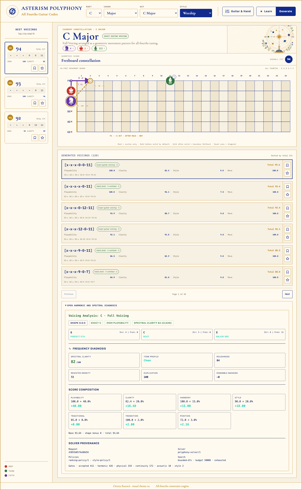

<div align="center">
  

  # Asterism Polyphony

  **A deterministic all-fourths guitar voicing engine and visual harmonic atlas.**

  `v1.0.0 · Days`

  [](https://github.com/ViniciusSchererDeOliveira/asterism-polyphony/releases/tag/v1.0.0)
  
  
  

  [Watch the full-quality MP4](docs/assets/readme/days-demo.mp4)
</div>

[](docs/assets/readme/days-demo.mp4)

## The idea

All-fourths tuning turns the fretboard into a regular lattice. Asterism Polyphony uses that regularity to search for playable chord voicings, rank them with explicit musical and physical criteria, and explain harmonic movement as geometry.

The interface treats degrees like chess pieces: the root is an anchor, while thirds and fifths travel through reproducible routes across strings, frets, and octaves. The result is not a static chord dictionary, but a deterministic instrument for exploring *why* one voicing may fit better than another.

## What `Days` can do

- Generate exact, shell, ensemble, extended, and explicitly tensioned voicings.
- Search within configurable guitar geometry, tuning, hand span, and fingering constraints.
- Rank candidates by playability, spectral clarity, harmony, style, transition, and position.
- Show every score component and the solver provenance behind a result.
- Compare physical transitions, pivots, muting changes, and reusable shapes.
- Visualize diatonic movement on a 24-fret all-fourths lattice.
- Explore style profiles for worship, J-rock, math rock, metalcore, and traditional harmony.



<table>
  <tr>
    <td width="62%">
      
    </td>
    <td width="38%">
      
    </td>
  </tr>
  <tr>
    <td align="center"><sub>Degree movement as geometric routes</sub></td>
    <td align="center"><sub>The same system on a narrow viewport</sub></td>
  </tr>
</table>

<details>
  <summary><strong>Open the full solver inspector</strong></summary>
  <br />
  
</details>

## A regular fretboard, a legible engine

In standard tuning, the major-third break between G and B interrupts transposition. In all-fourths tuning, every adjacent string keeps the same interval:

```text
E2  →  A2  →  D3  →  G3  →  C4  →  F4
     +P4     +P4     +P4     +P4     +P4
```

That symmetry lets one geometric rule remain pitch-correct wherever it fits. Polyphony builds on it with a bounded, deterministic search: the same normalized request and policy versions produce the same ordered result and request hash.

```text
musical request
      │
      ▼
candidate search ── hard physical gates
      │
      ▼
fingering + acoustic + style analysis
      │
      ▼
explainable ranking ── provenance ── visual atlas
```

## Run locally

### Requirements

- Node.js 22 or newer
- pnpm 9.1.1 via Corepack

```bash
corepack enable
pnpm install --frozen-lockfile
pnpm dev
```

Vite will print the local URL. The engine is built before the interface starts, so the web package always consumes the current core output.

## Verify the release

```bash
# TypeScript and production bundles
pnpm build

# Core plus integration/SSR suites
pnpm test

# Browser behavior and responsive contracts
pnpm test:browser

# Everything above
pnpm verify
```

The `Days` snapshot passes **70 core tests**, **97 integration and SSR tests**, and **7 Chromium interaction tests**.

## Repository map

```text
packages/
├── core/   deterministic solver, theory, geometry, scoring, provenance
├── web/    React interface, worker integration, visual atlas
└── e2e/    integration, SSR, regression, and stress contracts

tests-browser/   Playwright interaction and responsive tests
docs/assets/     release screenshots and demonstrations
```

The computational engine has no runtime dependencies. React and the browser worker remain at the presentation boundary.

## Scope and calibration

Polyphony is deliberately explicit about what its numbers mean:

- Search is bounded and deterministic; it does not claim a mathematically global top-k outside the configured budget.
- Ergonomic constraints are a configurable model of reach and fingering, not a biological measurement system.
- Acoustic and style scores are explainable heuristics, not universal judgments of tone or taste.

## Beyond `Days`

The engine is also a foundation for a future tablature system: an AI model could propose musical ideas while Polyphony validates physical feasibility, resolves concrete fretboard positions, ranks alternatives, and explains the result. That direction is intentionally presented as a future use of the engine, not a feature of this release.

## Release note

`Days` is named after the BAND-MAID song that inspired this release codename. The name marks the first public snapshot of the project; no BAND-MAID audio or artwork is included.

---

Built by [Vinicius Scherer de Oliveira](https://github.com/ViniciusSchererDeOliveira) · [contact@vscherer.me](mailto:contact@vscherer.me)

**Source available, all rights reserved.** No license is granted to use, copy, modify, or redistribute this code.
